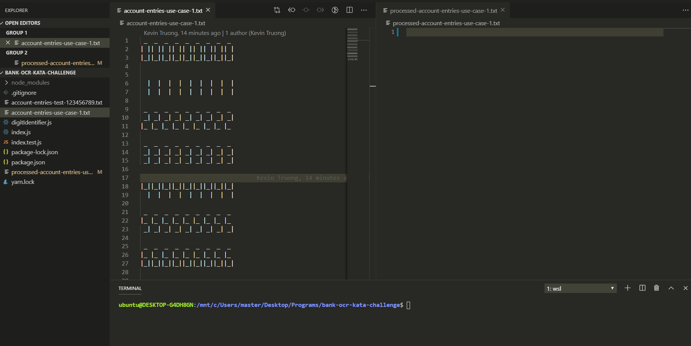

# bank-ocr-kata-challenge

Took on the challenge to try this coding kata and see how much I could get done in **3 hours**. However, I did read the challenge a couple days before I started coding and did do some mental preliminary designing! Even then, once I started the clock and wrote my first functions, I had to come back to refactor how I originally planned it.

My high level notes I wrote were:

* open the text file
* read the first / next 4 lines
* send those raw lines to an account number reader
* parse the lines 3 chars for each line at a time to identify a digit
* create a 9 digit account number string
* write to a file
* repeat until done

With the 3 hour limit, my goal was to fully get through User Story 3 and spend any extra time cleaning up (I knew User Story 4 would be a longer challenge and would be fun to add on afterwards instead of only just scratching the surface). I was able to get partially through User Story 3 where all I have to do is print "ERR" or "ILL" on the text file based on the checksum function. Should have only taken 10 - 15 minutes extra but decided to clean up my submission. 

## Screen Recording of Results

## Things I Wish I Did / How I would Improve It

* Would have liked to have used the CLI to choose the file instead of hard coding, ie. `node index.js account-entries-use-case-1.txt`
* The kata stated `A normal file contains around 500 entries`. With the current way it's written, it loads the entire file into memory. I should have written it so that the file streams in 4 lines at a time versus bringing in the entire thing. Similarly, my `parseAccountEntriesFile` loads each line into an array, meaning if a 500 entry file is processed, I'd end up with a 2000 element array. Not so good!
* Wasted too much time trying to figure out a "multiline" key JSON. I could have made my `digitIdentifier` with key/value pairs like `' _ | ||_|': 0,...`, but wanted to follow the "clue" and make the digits readable. Still happy with my `findIndex` method.
* Also lost time on my editor trimming whitespace on the account entries file so I had to disable that. For example, the digit 9 has a blank character for the last spot on it's top line, which got removed upon save. This lead to `undefined` when trying to read that spot. I want to make it more robust where I can check for `\n` maybe?
